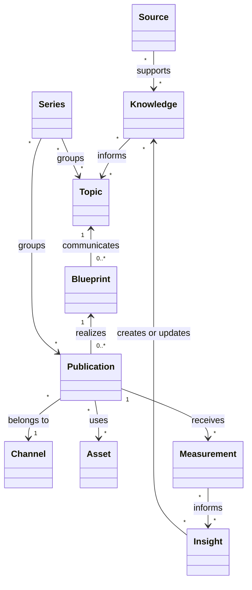

# Brand ontology v1

## Purpose

This is a lightweight, domain-driven model for planning, creating, reusing, distributing, and learning from personal-brand content. It is documentation, not a database schema, RDF/OWL model, API, or implementation contract.

## Bounded contexts

`Brand` is the root domain. Its primary contexts are Identity, Strategy, Audience, Marketing, Offers, Assets, Channels, Relationships, and Analytics. Marketing contains Content, Campaigns, Distribution, Growth, and Funnel. Content contains Knowledge, Source, Topic, Blueprint, Publication, Series, Workflow, and Taxonomy.

## Source migration map

| Former active reference | Canonical v1 location | Notes |
| --- | --- | --- |
| `IDENTITY.md` | [Identity](identity/README.md), [Strategy](strategy/README.md), [Offers](offers/README.md), [Channels](channels/README.md) | Identity remains the detailed narrative source; cross-context ownership is explicit. |
| `AUDIENCE.md` | [Audience](audience/README.md) | Moved intact with repaired links. |
| `OPERATING.md` | [Marketing / Content](marketing/content/README.md), [Channels](channels/README.md), [Analytics](analytics/README.md) | Content Operations remains the detailed operational source. |
| `VISUAL.md` | [Identity / visual](identity/visual.md) | Visual direction remains a supporting Identity reference. |
| `DESIGN.md` | [Assets / design](assets/design.md) | The reusable design-system contract is an Asset reference. |

The former paths are compatibility pointers for historical links. Plans, specifications, and the changelog remain in place as dated evidence.

## Core entities

| Entity | Definition |
| --- | --- |
| Knowledge | Reusable, attributable material: an insight, observation, experience, research finding, question, lesson, process, or framework. |
| Source | The origin that supports Knowledge, such as a document, dataset, recording, interview, or firsthand context. |
| Topic | A reusable subject or idea being communicated. It is not a post. |
| Blueprint | A Topic-specific communication plan: objective, audience, angle, pattern, structure, hook, CTA, proof, and constraints. |
| Publication | One channel-specific expression of a Topic through a Blueprint. |
| Series | A recurring editorial grouping of related Topics and/or Publications. |
| Workflow | A reusable lifecycle definition. A Work Item is one execution of that lifecycle for a specific subject. |
| Asset | A reusable media, design, brand, knowledge, or template resource. |
| Measurement | A dated observed metric for a Publication on a Channel. |
| Insight | An interpretation of Measurements that creates or revises Knowledge. |

## Relationships

- Knowledge and Topic are many-to-many. Source and Knowledge are many-to-many.
- A Topic has zero or many Blueprints; each Blueprint communicates one primary Topic.
- A Blueprint has zero or many Publications; each Publication has one primary Blueprint and one Channel in v1.
- Publications and Assets are many-to-many. Repurposed outputs are separate Publications linked by `derives from`.
- Series can group zero or many Topics and Publications. Campaign membership is optional and many-to-many.
- A Publication has many Measurements. Measurements inform Insights; Insights create or revise Knowledge.
- Workflow defines many Work Items. A Work Item has one current stage and one primary subject.

## Entities versus taxonomies

Use an entity when it has a reusable identity, independent lifecycle, provenance, or relationships. Keep the following as controlled taxonomies in v1: Knowledge kind, publication format, content pattern, content purpose, narrative structure, workflow stage, Topic mode, audience relationship, asset type, and metric name.

`Theme` is the single durable strategic lens. Do not introduce both Theme and Pillar in v1. A Blueprint is not a Template: Templates are Asset subtypes.

## Content flow

## V1 boundary

Do not model platform accounts, releases, claims, experiments, projects, people, organizations, or CRM relationships as first-class records yet. Promote them only when recurring work requires ownership, lifecycle, or analysis beyond a simple reference.
