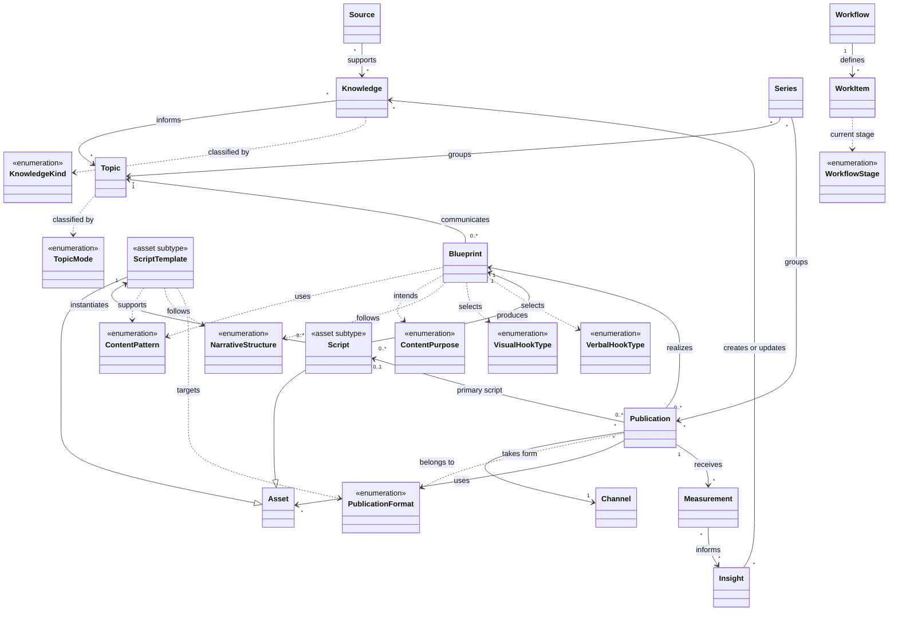

# Brand ontology v1

## Purpose

This is a lightweight, domain-driven model for planning, creating, reusing, distributing, and learning from personal-brand content. It is documentation, not a database schema, RDF/OWL model, API, or implementation contract.

## Bounded contexts

`Brand` is the root domain. Its primary contexts are Identity, Strategy, Audience, Marketing, Offers, Assets, Channels, Relationships, and Analytics. Marketing contains Content, Campaigns, Distribution, Growth, and Funnel. Content contains Knowledge, Source, Topic, Blueprint, Publication, Series, Workflow, and Taxonomy. Script and Script Template are Content Asset subtypes.

## Source migration map

| Former active reference | Canonical v1 location | Notes |
| --- | --- | --- |
| `IDENTITY.md` | [Identity](identity/README.md), [Strategy](strategy/README.md), [Offers](offers/README.md), [Channels](channels/README.md) | Identity remains the detailed narrative source; cross-context ownership is explicit. |
| `AUDIENCE.md` | [Audience](audience/README.md) | Moved intact with repaired links. |
| `OPERATING.md` | [Marketing / Content](marketing/content/README.md), [Channels](channels/README.md), [Analytics](analytics/README.md) | Content Operations remains the detailed operational source. |
| `VISUAL.md` | [Identity / visual](identity/visual.md) | Visual direction remains a supporting Identity reference. |
| `DESIGN.md` | [Assets / design](assets/design.md) | The reusable design-system contract is an Asset reference. |

The former paths are compatibility pointers for historical links. Plans, specifications, and the changelog remain in place as dated evidence.

## Core entities

| Entity | Definition |
| --- | --- |
| Knowledge | Reusable, attributable material: an insight, observation, experience, research finding, question, lesson, process, or framework. |
| Source | The origin that supports Knowledge, such as a document, dataset, recording, interview, or firsthand context. |
| Topic | A reusable subject or idea being communicated. It is not a post. |
| Blueprint | A Topic-specific communication plan: objective, audience, angle, pattern, structure, hook, CTA, proof, and constraints. |
| Publication | One channel-specific expression of a Topic through a Blueprint. |
| Series | A recurring editorial grouping of related Topics and/or Publications. |
| Workflow | A reusable lifecycle definition. A Work Item is one execution of that lifecycle for a specific subject. |
| Asset | A reusable media, design, brand, knowledge, script, or template resource. A Script is a versioned, publication-oriented authored asset; a Script Template is reusable fill-in-the-blank scaffolding that generates Scripts. |
| Measurement | A dated observed metric for a Publication on a Channel. |
| Insight | An interpretation of Measurements that creates or revises Knowledge. |

## Relationships

- Knowledge and Topic are many-to-many. Source and Knowledge are many-to-many.
- A Topic has zero or many Blueprints; each Blueprint communicates one primary Topic.
- A Blueprint has zero or many Publications; each Publication has one primary Blueprint and one Channel in v1.
- A Blueprint has zero or many Script Assets; each Script has one primary Blueprint. A Publication may use one primary Script plus other Assets.
- Publications and Assets are many-to-many. Repurposed outputs are separate Publications linked by `derives from`.
- Series can group zero or many Topics and Publications. Campaign membership is optional and many-to-many.
- A Publication has many Measurements. Measurements inform Insights; Insights create or revise Knowledge.
- Workflow defines many Work Items. A Work Item has one current stage and one primary subject.

## Entities versus taxonomies

Use an entity when it has a reusable identity, independent lifecycle, provenance, or relationships. Use a taxonomy when a shared controlled label classifies an entity but does not require its own lifecycle. `Theme` is the single durable strategic lens. Do not introduce both Theme and Pillar in v1. A Blueprint is not a Template: Templates are Asset subtypes.

## Taxonomies

These are the canonical v1 starter vocabularies. They are deliberately extensible, but additions should be made here before use so that planning and analysis retain a shared language.

### Blueprint taxonomies

| Taxonomy | Applied to | Values | Definition |
| --- | --- | --- | --- |
| Content Pattern | Blueprint | Story, Educational, List, Tutorial, Framework, Case Study, Breakdown, Comparison, Myth vs Fact, Opinion, Challenge, Journey, Experiment, Prediction, Reaction, Review, Behind the Scenes | The repeatable editorial shape. Use `Story` for storytelling and `Educational` for explanatory teaching. |
| Content Purpose | Blueprint | Educate, Inform, Entertain, Inspire, Persuade, Build Trust, Engage, Convert | The intended audience effect. A Blueprint may identify one primary purpose and supporting purposes. |
| Narrative Structure | Blueprint | Hook → Journey → Payoff; Problem → Solution; Before → After; Setup → Conflict → Resolution; Question → Answer; Claim → Evidence; Hook → Problem → Framework → Example → Payoff; Scroll Stopper + Verbal Hook → Development → Payoff | The ordered rhetorical or story sequence inside the expression. |
| Visual Hook Type | Blueprint | Potential Energy, Kinetic Energy, General Motion, Trend Hook, God View, Novel / Unusual Visual, Emotionally Charged Imagery, Close-Up Shot, Rapid Scene Change, Bold Colors / High Contrast, Visual Symmetry / Balance, Celebrity / Face Equity, Satisfying, Cute Hook, Text Hook | The visual mechanism used to stop the scroll. |
| Verbal Hook Type | Blueprint | Question, Personal Story, Statistic, Quotation, Fact, Shocking / Exaggeration, Description, Cliffhanger / Suspense, Humor, Dialogue, Emotion, Prediction, Motivational, Opinion, Definition | The spoken or on-screen language mechanism that establishes the audience promise or open loop. |

Content Pattern answers **what kind of editorial treatment is this?** Content Purpose answers **what should it do for the audience?** Narrative Structure answers **in what order is it communicated?** These are separate classifications and may be combined freely when they make sense.

For the short-form structure, the Scroll Stopper and Verbal Hook begin together; Development carries the proof, observation, story, or example; Payoff fulfills the promise. The source's 60-second timing is guidance for that template only: Scroll Stopper 0–3 seconds, Verbal Hook 0–5 seconds, Payoff in the final 5–10 seconds.

### Hook usage conditions

| Condition | Hook types |
| --- | --- |
| Evidence required | Statistic, Fact, Quotation |
| Editorial review required | Trend Hook, Celebrity / Face Equity, Cute Hook, Shocking / Exaggeration, Motivational |
| Always required | Truthfulness, documentary restraint, observation over preaching, and no unsupported performance claims. |

### Content and delivery taxonomies

| Taxonomy | Applied to | Values | Definition |
| --- | --- | --- | --- |
| Knowledge Kind | Knowledge | Insight, Observation, Experience, Research, Opinion, Idea, Question, Lesson, Process, Framework, Evidence | The nature of reusable source material. `Source` remains a separate entity because it is provenance, not a kind of Knowledge. |
| Topic Mode | Topic | Build, Offline, Bridge | The Brand toggle lens. `Bridge` connects the two modes; it is not a third brand identity. |
| Publication Format | Publication | Text Post, Thread, Carousel, Short-form Video, Long-form Video, Article, Newsletter | The channel-neutral form of a Publication. The Channel identifies where it appears, such as Instagram, X, LinkedIn, or YouTube. |
| Workflow Stage | Work Item | Capture, Validate, Plan, Draft, Review, Produce, Publish, Measure, Learn, Reuse / Repurpose | The current lifecycle stage of a particular work execution. |

### Supporting taxonomies

| Taxonomy | Applied to | Values |
| --- | --- | --- |
| Audience Relationship | Audience Segment | Addressed, Spoken-with, Spoken-about |
| Asset Type | Asset | Media, Design, Brand, Knowledge Asset, Script, Template, Script Template |
| Media Type | Media Asset | Image, Video, Audio, Screenshot, Recording, B-roll |
| Metric Name | Measurement | Impressions, Views, Watch Time, Completion Rate, Likes, Comments, Saves, Shares, Clicks |

## Content flow

## V1 boundary

Do not model platform accounts, releases, claims, experiments, projects, people, organizations, or CRM relationships as first-class records yet. Promote them only when recurring work requires ownership, lifecycle, or analysis beyond a simple reference.
